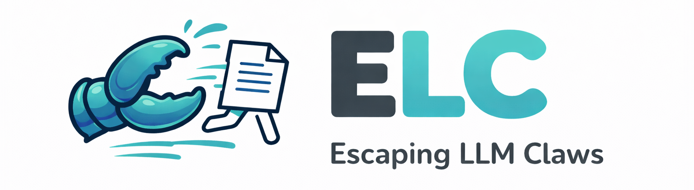
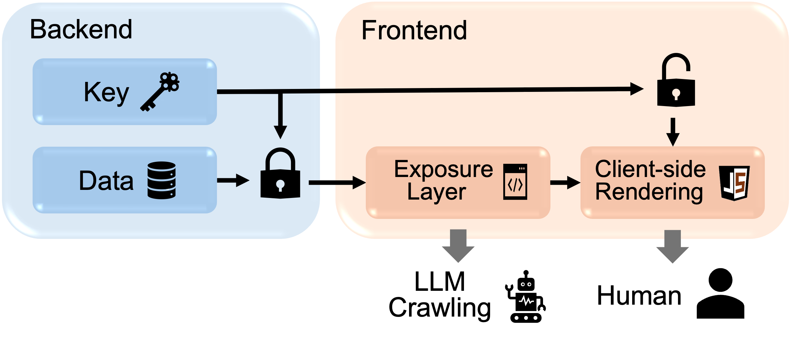

<p align="center">
  
</p>

<h3 align="center">Protect Your Web Content from LLM Claws</h3>

<p align="center">
  <a href="LICENSE"></a>
  
  <a href="https://github.com/ailab-center4safety/escape-llm-claw"></a>
</p>

---

## Why do We Release ELC

LLM-based Agent ("claws") aggressively crawl internet-scale information during task execution, potentially collecting sensitive data. Restricting such automated crawling while preserving normal human browsing has become an urgent need!

## Quick Start

```bash
git clone https://github.com/AI45Lab/escape-llm-claw.git
cd escape-llm-claw
bash runs/install.sh
bash runs/elc.sh
```
This enables you to set up a web service at local port [http://127.0.0.1:5000](http://127.0.0.1:5000). After deploying the web service to a pulicly accessible server, you can further verify whether LLM agent is able to craw the website. For preliminary testing, we recommend using [Ngrok](https://ngrok.com/) to temporarily expose your local machine to external LLMs.

## How Effective is ELC

ELC reduces agent crawling success rate by **93% on average** across major frontier models:

| Model | Direct Access | Crawl (no tools) | Crawl (with tools) |
|-------|:-------------:|:----------------:|:------------------:|
| GPT-5.2-High | 89.0% | 0.0% | 2.0% |
| Gemini-3-Pro | 83.0% | 0.0% | 1.2% |
| DeepSeek-R1 | 100.0% | 0.0% | 20.5% |
| Qwen-Flash | 100.0% | 0.0% | 20.0% |

## Demonstration

<p align="center">
  
</p>

A public deployment of the web service is available at: <https://kinolee.pythonanywhere.com/>

## How does ELC Escape Agent Claws

**Key Insight:** Agents crawl *server-side* rendered content to minimize latency, while humans consume *client-side* rendered content and tolerate delays.

**ELC exploits this gap:**
- Server-side AES-GCM encryption protects data from agent  claws
- Client-side JavaScript decryption reveals content to human users
- Zero changes needed to your existing content workflow

<p align="center">
  
</p>

<!-- ## How It Works

1. **Encryption**: Content is encrypted with AES-128-GCM and embedded into images using LSB steganography
2. **Serving**: Flask serves pages with encrypted payloads in HTML data attributes
3. **Decryption**: Browser JavaScript extracts and decrypts content via Web Crypto API

This lightweight approach integrates seamlessly into existing web services with minimal overhead. -->

## License

MIT License - see [LICENSE](LICENSE) for details.
